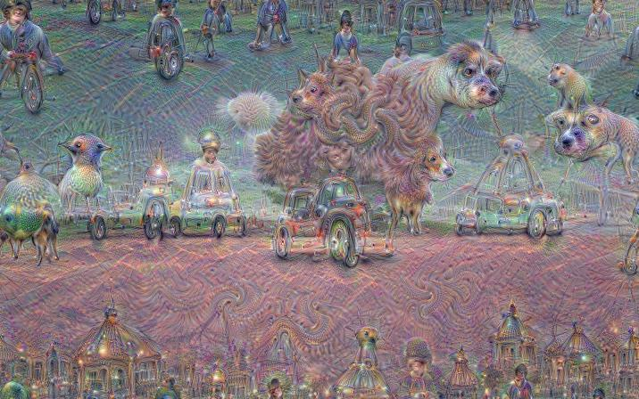

# DeepDream Workshop

The [Bay Area Women in Machine Learning & Data Science](http://www.meetup.com/Bay-Area-Women-in-Machine-Learning-and-Data-Science/) meetup group hosted a [DeepDream Workshop](http://www.meetup.com/Bay-Area-Women-in-Machine-Learning-and-Data-Science/events/224080723/) meetup on August 25, 2015.  This file walks through the installation of the software required to create "Deep Dream" images like the one below using Google's [demo notebook](https://github.com/google/deepdream).  Currently, we have OS X install instructions (using [Homebrew](http://brew.sh/) Python) only.  



## Prerequisites

The DeepDream code uses [Caffe](http://caffe.berkeleyvision.org/) and Python, so you will first need to install these prerequisites.  Below, we will walk through installing everything you need to start deep-dreaming.  These instructions fill in the details of the official [Caffe OS X install instructions](https://github.com/BVLC/caffe/wiki/Installation-%28OSX%29).

### Python 
Install Python, IPython/Jupyter and pip:

If you don't already have Python installed or if you are using the default Mac Python installtion, you should install Homebrew and then install Python via Homebrew.
```bash
# Homebrew
ruby -e "$(curl -fsSL https://raw.githubusercontent.com/
Homebrew/install/master/install)"
```
If you already have Homebrew installed, you may want to update:
```bash
brew update
```
If you see warnings when running `brew doctor`, it might be because you are an R user who installed the official R binary.  That's shouldn't be a problem and is exaplained in further detail [here](http://azaleasays.com/2014/08/25/homebrew-warnings-about-unbrewed-dylibs-installed-by-r/).


This will install Python 2.7 via Homebrew.  If you use Anaconda or some other system to manage your Python installation, then you can ignore this step.  Just make sure that you have the appropriate Python packages installed.

```bash
# Python 2.7
brew install python
brew install python-dev
```

Homebrew should update your `PATH` variable so that when you type `python`, it will default to the Homebrew version, but to verify, you can do the following:
```bash
which python
```
It should return `/usr/local/bin/python` if Homebrew Python is the default.


Install a handful of Python packages via pip: 
```bash
pip install -U numpy
pip install -U scipy
pip install -U ipython
pip install -U jupyter
```
There are a few other Python dependencies for Pycaffe (Python API for Caffe), but we will install those below.

### Caffe

Installation instructions for OS X [here](http://caffe.berkeleyvision.org/install_osx.html).  There are also some OS X installation notes on the [wiki](https://github.com/BVLC/caffe/wiki/Installation-%28OSX%29).

- CUDA is required for GPU mode.
- BLAS via ATLAS, MKL, or OpenBLAS.  (Already installed via Accelerate framework on OS X)
- Boost >= 1.55
- OpenCV >= 2.4 including 3.0
- protobuf, glog, gflags
- IO libraries hdf5, leveldb, snappy, lmdb


#### CUDA Support
Macbook Pros may not have an NVIDIA GPU, and if so, it will not be possible to use Caffe's GPU mode, so you can skip the "Install CUDA" step.  If you do have an NVIDIA GPU, then you can 
install the CUDA dmg or pkg file [here](https://developer.nvidia.com/cuda-downloads), or `wget` and execute the dmg file to begin a network installation:
```bash
wget http://developer.download.nvidia.com/compute/cuda/7_0/Prod/network_installers/cuda_7.0.29_mac_network.dmg
open cuda_7.0.29_mac_network.dmg
```


According to the Caffe authors, it will be best if the following vars are not set:
```bash
echo $LD_LIBRARY_PATH
```

General Caffe dependencies can be installed via Homebrew:
```bash
brew install -vd snappy leveldb gflags glog szip lmdb
# need the homebrew science source for OpenCV and hdf5
brew tap homebrew/science
brew install hdf5 opencv
```

Since we are going to use pycaffe:
```bash
# with Python pycaffe needs dependencies built from source
brew install --build-from-source --with-python -vd protobuf
brew install --build-from-source -vd boost boost-python
```
(For the last command, there was a warning of `Warning: boost-1.58.0 already installed` since I had previously brew installed boost, but this didn't cause any issues.)

There is a note on the Caffe [wiki](https://github.com/BVLC/caffe/wiki/Installation-%28OSX%29) that warns against using boost 1.56 and 1.58.  I did not have any issues with 1.58, but if that happens to you, you can install use boost 1.55 as follows (code not tested!):
```
brew uninstall boost boost-python
cd /usr/local
git checkout a252214 /usr/local/Library/Formula/boost.rb
brew install --build-from-source --with-python --fresh -vd boost
brew pin boost  #this will prevent you from inadvertenly upgrading your boost
```


#### Compile Caffe
Lastly, check that Caffe and dependencies are linking against the same, desired Python.  If you used Homebrew to install Python and followed the rest of the instructions above, you should be okay.

Now we will compile Caffe.  First `cd` to the local directory where you want to check out the code and then clone the Caffe repository.
```bash
git clone https://github.com/BVLC/caffe.git
cd caffe
cp Makefile.config.example Makefile.config
```

Since I am using a laptop with no CUDA support, we will modify the `Makefile.config` to use CPU only.  Uncomment the following line:
```
# CPU_ONLY := 1
```

I am also using the Homebrew version of Python, so I will have to update the location information for the Python-related variables.  The default Python library location in `Makefile.config` is:

```bash
PYTHON_LIB := /usr/lib
```

You can figure the correct location for your Python installation on your machine by running `locate libpython*` and including the appropriate Homebrew directory with the .so or .dylib.

```bash
locate libpython*
```

On my system the relevant .dylib file was located here (although the locate command above did not return anything): `/usr/local/Cellar/python/2.7.10/Frameworks/Python.framework/Versio
ns/Current/lib/libpython2.7.dylib`

So I added the following lines to my `Makefile.config` and commented out the existing `PYTHON_INCLUDE` and `PYTHON_LIB`:
```
BREWPY_HOME := /usr/local/Cellar/python/2.7.10/Frameworks/Python.framework/Versions/Current
PYTHON_INCLUDE := $(BREWPY_HOME)/include \
		 $(BREWPY_HOME)/include/python2.7 \
		 $(BREWPY_HOME)/lib/python2.7/site-packages/numpy/core/include \
```

```bash
PYTHON_LIB := /usr/local/Cellar/python/2.7.10/Frameworks/Python.framework/Versions/Current/lib
```

Lastly, let's build Caffe!


```
make
make test
make runtest
```
If the tests go well, you will see output that ends with the following lines:
```
[----------] 12 tests from NesterovSolverTest/1 (173 ms total)

[----------] Global test environment tear-down
[==========] 846 tests from 129 test cases ran. (22218 ms total)
[  PASSED  ] 846 tests.
```

Finally, let's build the Python API:
```bash
make pycaffe
```

To import the caffe Python module after completing the installation, open up your `~/.bashrc` file and add the following line to add the module directory to your `$PYTHONPATH`:
```bash
export PYTHONPATH=/path/to/caffe/python:$PYTHONPATH 
```
For example, in my case, I added the following line:
```bash
export PYTHONPATH=/Users/me/code/github-repos/caffe/python:$PYTHONPATH
```

You will need a few more Python libraries before pycaffe will actually run.  To install the remaining dependencies:
```bash
cd python
for req in $(cat requirements.txt); do pip install $req; done
```


## DeepDream Notebook

You can clone the repo here:
```bash
git clone https://github.com/google/deepdream.git
```

Next, we will begin executing the DeepDream notebook.  First, start the notebook server:
```bash
cd deepdream
ipython notebook
```
This will open a window in your browser, which you can use to click on the `dream.ipynb` file.

But wait! Before executing any of the code, we will need to download the Caffe model trained on the GoogleNet images since this notebook uses this particular model.  More info [here](https://github.com/BVLC/caffe/tree/master/models/bvlc_googlenet).

```bash
cd /Users/me/code/github-repos/caffe/models/bvlc_googlenet
wget http://dl.caffe.berkeleyvision.org/bvlc_googlenet.caffemodel
```

Once the model has been downloaded, head back to the notebook and begin executing the cells.


